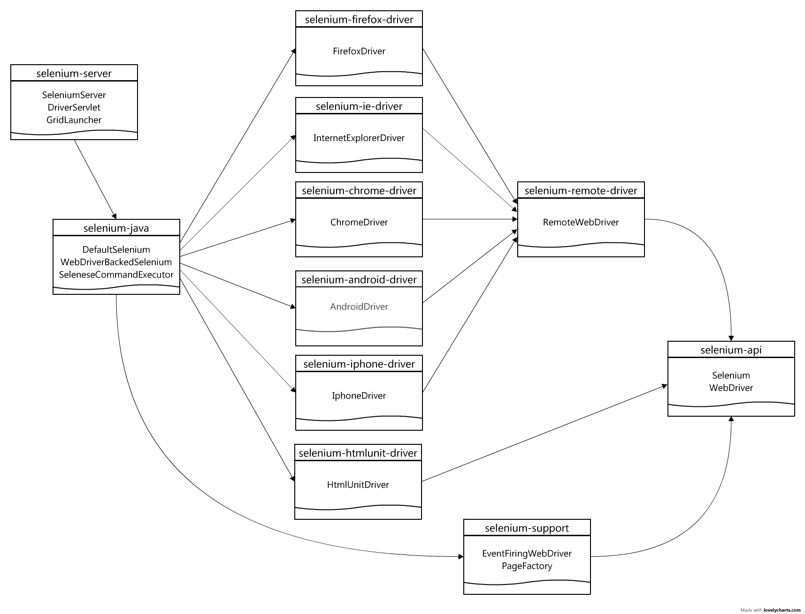

# Selenium

- http://www.seleniumhq.org
- https://github.com/SeleniumHQ/selenium

### About

Selenium is an umbrella project encapsulating a variety of tools and
libraries enabling web browser automation. Selenium specifically
provides infrastructure for the [W3C WebDriver specification](https://dvcs.w3.org/hg/webdriver/raw-file/tip/webdriver-spec.html)
— a platform and language-neutral coding interface compatible with all
major web browsers.

The project is made possible by volunteer contributors who've
generously donated thousands of hours in code development and upkeep.

Selenium's source code is made available under the [Apache 2.0 license](https://github.com/SeleniumHQ/selenium/blob/master/LICENSE).

### Dependents

- [HtmlUnit](http://htmlunit.sourceforge.net/)

### Documentation

- http://www.seleniumhq.org/docs/cn/
- http://docs.seleniumhq.org/docs/#selenium-documentation
- https://seleniumhq.github.io/docs/
- https://github.com/SeleniumHQ/selenium/wiki
- https://sites.google.com/a/chromium.org/chromedriver/
- http://selenium-release.storage.googleapis.com/index.html

### Maven Repository

- https://repo.maven.apache.org/maven2/org/seleniumhq/selenium/

### Use Maven

```xml
    <dependency>
        <groupId>org.seleniumhq.selenium</groupId>
        <artifactId>selenium-java</artifactId>
        <version>2.44.0</version>
    </dependency>
    <dependency>
        <groupId>org.seleniumhq.selenium</groupId>
        <artifactId>selenium-htmlunit-driver</artifactId>
        <version>2.44.0</version>
        <exclusions>
            <exclusion>
                <groupId>org.apache.httpcomponents</groupId>
                <artifactId>httpclient</artifactId>
            </exclusion>
            <exclusion>
                <groupId>net.sourceforge.htmlunit</groupId>
                <artifactId>htmlunit</artifactId>
            </exclusion>
        </exclusions>
    </dependency>
    <dependency>
        <groupId>org.apache.httpcomponents</groupId>
        <artifactId>httpclient</artifactId>
        <version>4.3.4</version>
    </dependency>
    <dependency>
        <groupId>net.sourceforge.htmlunit</groupId>
        <artifactId>htmlunit</artifactId>
        <version>2.15</version>
    </dependency>
```

### Add Cookies

Three steps to add the cookie

```java
    Set<Cookie> cookies = ... ;
    WebDriver driver = new ChromeDriver();
    // 1. open domain
    driver.get("http://www.zhihu.com/");
    // 2. add cookie
    for (Cookie cookie : cookies) {
        driver.manage().addCookie(cookie);
    }
    // 3. refresh domain
    driver.get("http://www.zhihu.com/");
```

### Maven Map


